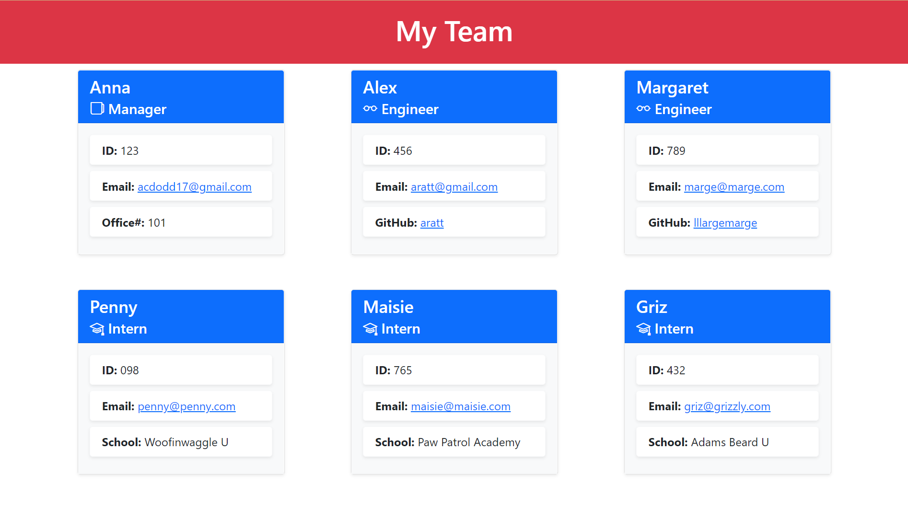

# TEAM PROFILE GENERATOR 

## DESCRIPTION
This is a Node.js command-line application that takes in information about employees on a software engineering team and generates an HTML webpage that displays summaries for each person in a card.

## USER STORY
`AS A manager
I WANT to generate a webpage that displays my team's basic info
SO THAT I have quick access to their emails and GitHub profiles`

## INSTALLATION
- `git clone` this repository to use locally 
- run `npm init` to install all the necessary npm packages
- run `npm install inquirer` to allow for user input
- run `npm install jest --save-dev` to add Jest testing framework to devDependencies list

## USAGE
After runing `node index.js` in the command line to initialize the application, answer all prompts to generate a new index.html file for your project. You will find your new team profile written to the index.html file in the 'dist' folder.

Example Team Profile:

## CONTRIBUTIONS
Made with by ❤ [Anna Dodd](https://github.com/acdodd17)

